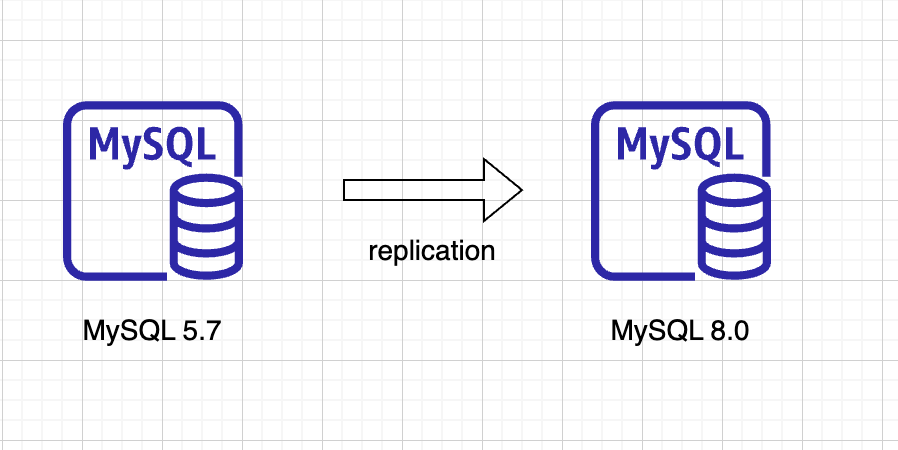

# mysql_upgrade
## 1. MySQL EOL
| 버전 | EOL 날짜 | Upgrade 방식 | 비고 |
|---|:---:|:---|---|
| `MySQL 5.6` | 2021/02/05 | 5.6 -> 5.7 -> 8.0 or backup/dump | 서비스 유지보수는 종료됨 |
| `MySQL 5.7` | 2023/10/21 | 5.7 -> 8.0 or backup/dump |  |

## 2. Major changes of MySQL 8.0 compared to previous version
(삭제된 feature : https://dev.mysql.com/doc/refman/8.0/en/mysql-nutshell.html#mysql-nutshell-removals)
- Account
    - 계정 생성할 때 create user 구문 사용
    - identified by password 구문 제거, set password = password('auth_string')도 제거
    - cache가 적용된 SHA256 인증 방식 사용 (8.0 이전까지 mysql_native_password 방식 사용)
      - MySQL 8.0 이전 client를 사용시 오류가 발생하면 아래 옵션 추가(임시적 사용후 변경권장)
        - default_authentication_plugin=mysql_native_password (mysqld)
- Query cache 
    - 해당 기능은 삭제되어 더 이상 지원 되지 않음. (기존 남아 있는 옵션은 향후 삭제될 예정임)
- Spatial 관련 함수 명칭 변경
    - 여러 이름으로 존재 하던 공간 관련 함수를 ST_와 MBR로 유지후 나머지는 deprecated
- Default character set 변경
    - utf8mb4 (default character set), utf8mb4_0900_ai_ci (default collation)   
      (utf8mb4_0900_ai_ci는 한글 검색상에 이슈가 있어 utf8mb4_bin등올 변경권장)
    - 기존 character set 변경 방법   
      ```
      table : alter table city default charset=utf8mb4
      column : alter table city modify column countrycode char(3) character set utfmb48 not null default '';
      ```
- SQL Mode 체크
    - MySQL 5.7 : ONLY_FULL_GROUP_BY,STRICT_TRANS_TABLES,NO_ZERO_IN_DATE,NO_ZERO_DATE,ERROR_FOR_DIVISION_BY_ZERO,   
                  NO_AUTO_CREATE_USER,NO_ENGINE_SUBSTITUTION
    - MySQL 8.0 : ONLY_FULL_GROUP_BY,STRICT_TRANS_TABLES, NO_ZERO_IN_DATE, NO_ZERO_DATE, ERROR_FOR_DIVISION_BY_ZERO,
                  NO_ENGINE_SUBSTITUTION
- Data dictionary table 방식으로 통합
    - system table(ex,mysql, performance_schema, etc)도 data dictionary 방식으로 변경

## 3. MySQL upgrade check in advance
- mysql-shell
    - util.checkForServerUpgrade 사용하여 사전에 확인
        - ex) mysqlsh JS > util.checkForServerUpgrade()
    - 체크시 warning, error이 발생하면 해당 사항에 대해서 조치를 진행 

## 4. MySQL upgrade procedure
Upgrade 하기전에 먼저 기존 MySQL에 대한 백업은 꼭 진행함.

- install binary (신규설치, 권장)
  - 구성 아키텍처   
    Upgrade용 신규 MySQL를 구성한 후 데이터 이관 (mysqlsh), 데이터 replication를 통한 upgrade
    

- replace old packages with new (기존설치 대체, In-Place Upgrade)
  - 기존 MySQL binary (5.7) 백업
  - 신규 MySQL binary (8.0.x) 대체
  - 아래와 같이 upgrade 수행
    - MySQL 8.0.16 이전 : MySQL start, mysql_upgrade 명령어 수행 (DBA 수동)
    - MySQL 8.0.16 이후 : MySQL start
  - 신규 변경된 MySQL로 restart 재진행 후 에러 발생 유무 확인
  - upgrade후 application에서 사용하는 SQL 확인 및 test   

