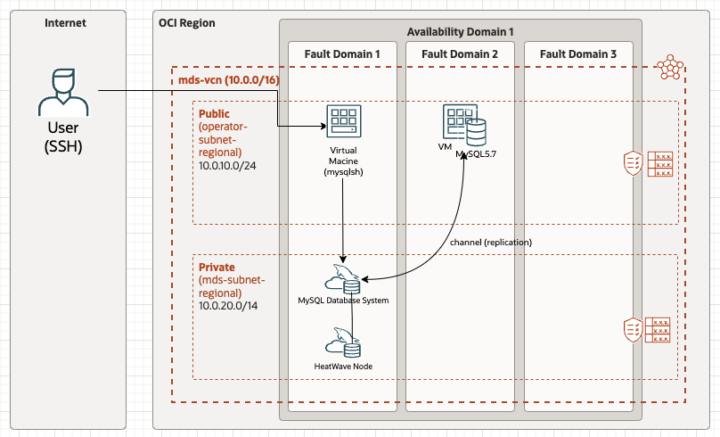

# 1. 전체 MDS 구성도    
OCI에 있는 MDS, HeatWave, Replication 테스트를 하기 위해 아래와 같이 구성하여 테스트 진행    
Source(MySQL 5.7)를 제외하고는 아래 Delpoy를 아이콘을 클릭하여 설치를 진행하면 자동으로 구성을 진행함      
   

# 2. Source 구성   
위에 그림에서 MySQL 5.7에 해당 하는 부분은 직접 VM 인스턴스를 생성하여 MySQL 설치하여 구성함

## 1) VM 구성    

## 1) MySQL 5.7 Download
wget https://dev.mysql.com/get/Downloads/MySQL-5.7/mysql-5.7.42-linux-glibc2.12-x86_64.tar

# 3. Target 구성